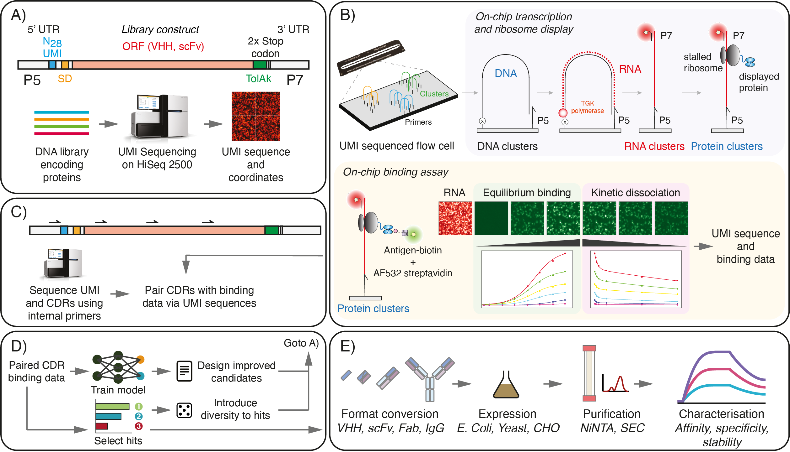
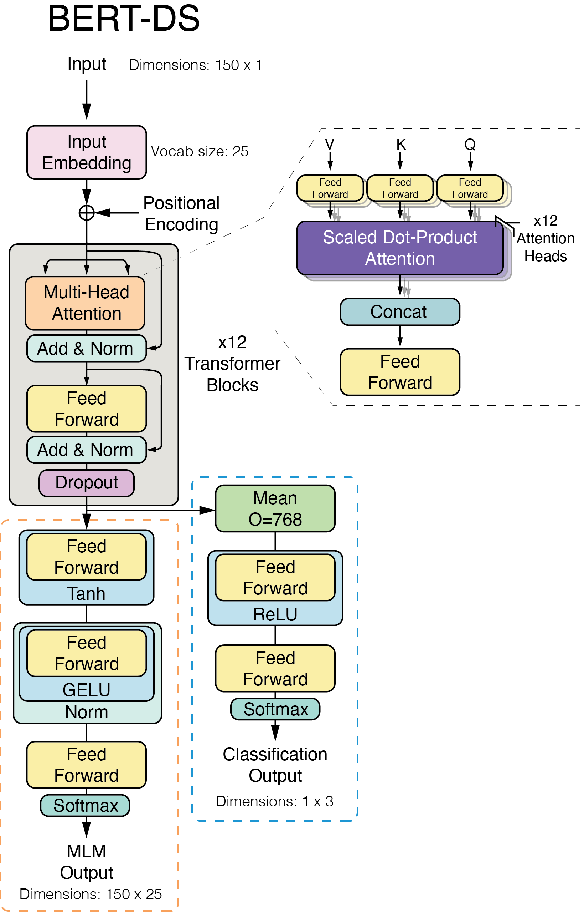

# Deep Screening

  

Source code for Porebski et al., (2023) Rapid discovery of high-affinity antibodies via massively parallel sequencing, ribosome display and affinity screening. Nat. Biol. Eng., doi: [10.1038/s41551-023-01093-3](https://doi.org/10.1038/s41551-023-01093-3).

It contains the:
- Analysis pipeline for processing a deep screening dataset.
- Training code for the Bert-DS language model.

## Core dependencies

- numpy
- scipy
- MPI4py
- scikit-image
- opencv
- pytorch
- scikit-learn
- zeromq
- matplotlib
- pytorch_lightning
- torchmetrics

## BERT-DS model
BERT-DS is a language model for the classification of antibody binding to HER2, given a heavy chain protein sequence. 

  

## Datasets
Datasets used in the deep screening paper can be found here: 

## Licence

This software and datasets are distributed under the terms of a CC BY-NC-ND 4.0 licence.
